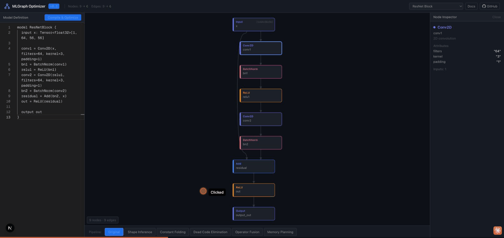
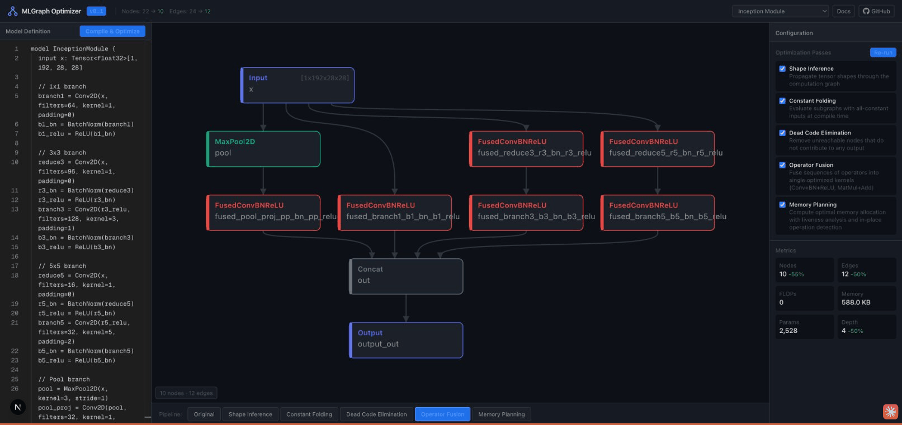

<div align="center">

# MLGraph Optimizer

**ML Computation Graph Compiler & Optimizer Visualizer**

[Live Demo](https://mlgraph-optimizer.vercel.app) &nbsp;&middot;&nbsp; [Documentation](https://0xtkey256.gitbook.io/mlgraph-optimizer) &nbsp;&middot;&nbsp; [Report Bug](https://github.com/0xtkey256/mlgraph-optimizer/issues)



</div>

---

An interactive tool for defining neural network models, compiling them into computation graph intermediate representations (IR), applying compiler optimization passes, and visualizing each transformation step — like [Compiler Explorer](https://godbolt.org) but for ML models.

## Features

- **Custom DSL** &mdash; Define models using a concise, human-readable domain-specific language with syntax highlighting via Monaco Editor
- **Immutable Graph IR** &mdash; Every optimization pass produces a new graph snapshot, enabling full transformation history and step-through
- **5 Optimization Passes** &mdash; Shape Inference, Constant Folding, Dead Code Elimination, Operator Fusion, Memory Planning
- **Interactive Visualization** &mdash; D3.js + ELK.js layered graph rendering with zoom, pan, and node inspection
- **Real-time Metrics** &mdash; Track node count, edge count, FLOPs, memory footprint, parameters, and graph depth across passes
- **13 Example Models** &mdash; From simple MLPs to Transformer blocks, Inception modules, GANs, and Squeeze-and-Excitation networks

## Architecture

```
mlgraph-optimizer/
├── apps/web/                # Next.js frontend (Vercel)
│   ├── src/components/      # Editor, GraphView, Sidebar, Timeline
│   ├── src/stores/          # Zustand state management
│   └── src/lib/             # Example model definitions
├── packages/core/           # @mlgraph/core — TypeScript graph IR + optimizer
│   ├── src/ir/              # Graph, Node, Edge, Port types
│   ├── src/passes/          # Optimization passes
│   ├── src/parser/          # DSL + JSON parsers
│   └── src/analysis/        # Metrics, graph diff
├── packages/ui/             # @mlgraph/ui — Shared visualization components
└── examples/                # .mlg model definition files
```

### Optimization Passes

| Pass | Description | Effect |
|------|-------------|--------|
| **Shape Inference** | Propagates tensor shapes through the graph | Annotates every edge with dtype and dimensions |
| **Constant Folding** | Evaluates subgraphs with all-constant inputs | Replaces computable subgraphs with single constant nodes |
| **Dead Code Elimination** | Removes nodes unreachable from outputs | Prunes orphaned branches via backward BFS |
| **Operator Fusion** | Fuses operator sequences into optimized kernels | Conv2D+BatchNorm+ReLU &rarr; FusedConvBNReLU, MatMul+Add &rarr; FusedMatMulAdd |
| **Memory Planning** | Computes memory allocation with liveness analysis | Identifies in-place operations and peak memory usage |

### Example: Inception Module Optimization



*Inception Module after Operator Fusion: 22 nodes &rarr; 10 (-55%), 24 edges &rarr; 12 (-50%), depth 8 &rarr; 4 (-50%). Each Conv2D+BatchNorm+ReLU chain is fused into a single FusedConvBNReLU kernel.*

## DSL Syntax

```
model ResNetBlock {
  input x: Tensor<float32>[1, 64, 56, 56]

  conv1 = Conv2D(x, filters=64, kernel=3, padding=1)
  bn1 = BatchNorm(conv1)
  relu1 = ReLU(bn1)
  conv2 = Conv2D(relu1, filters=64, kernel=3, padding=1)
  bn2 = BatchNorm(conv2)
  residual = Add(bn2, x)
  out = ReLU(residual)

  output out
}
```

**Supported operations:** Input, Output, Constant, MatMul, Add, Mul, Conv2D, BatchNorm, LayerNorm, ReLU, GELU, Sigmoid, Softmax, MaxPool2D, AvgPool2D, GlobalAvgPool, Reshape, Transpose, Flatten, Concat, Split, ReduceSum, ReduceMean

## Tech Stack

| Layer | Technology |
|-------|-----------|
| Monorepo | Turborepo + npm workspaces |
| Frontend | Next.js 16, React 19, Tailwind CSS |
| Editor | Monaco Editor (VS Code engine) |
| Graph Layout | ELK.js (layered algorithm) |
| Rendering | D3.js (SVG) |
| State | Zustand |
| Deployment | Vercel |

## Getting Started

```bash
git clone https://github.com/0xtkey256/mlgraph-optimizer.git
cd mlgraph-optimizer
npm install
npm run dev
```

Open [http://localhost:3000](http://localhost:3000) — select an example from the dropdown or write your own model, then click **Compile & Optimize**.

## Included Examples

| Category | Models |
|----------|--------|
| **Classic** | Simple MLP, Image Classifier |
| **CNN** | ResNet Block, ResNet Bottleneck, VGG Block, Inception Module |
| **Transformer** | Multi-Head Attention, Transformer Block, Seq2Seq Encoder-Decoder |
| **Generative** | Conv Autoencoder, GAN Generator |
| **Efficient** | Depthwise Separable Conv, Squeeze-and-Excitation |

## Roadmap

- [ ] Python + Rust native engine via PyO3 for high-performance optimization
- [ ] WASM compilation of Rust core for in-browser native-speed execution
- [ ] Additional passes: layout transformation, quantization, graph partitioning
- [ ] Export to ONNX format
- [ ] Side-by-side diff view between optimization steps
- [ ] 3D tensor shape visualization with Three.js

## License

MIT

## Contributing

Contributions are welcome. Please open an issue first to discuss what you would like to change.
